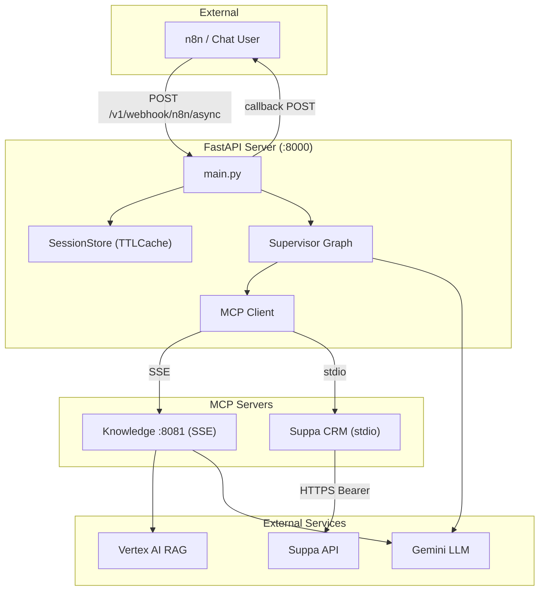
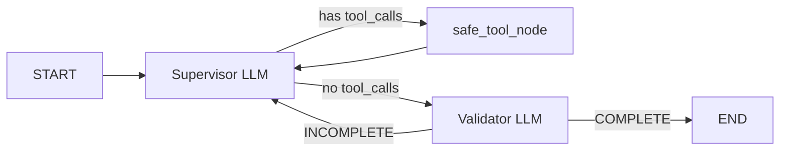

# Enterprise AI Orchestration — System Documentation

## Overview

Python backend connecting a conversational AI to **Suppa CRM** (via MCP) and an internal **knowledge base** (Vertex AI RAG). Users interact via n8n chat triggers — queries are processed through a multi-agent supervisor loop, and results are delivered back via webhook callbacks.

## Architecture



---

## Full Request Pipeline

### Phase 1: Request Intake

User sends query + session_id via n8n → FastAPI returns 202 + schedules background task.

### Phase 2: Session Memory

Loads conversation history from `SessionStore` (TTLCache, 5min TTL, max 10 turns).

### Phase 3: Supervisor Graph



Max 6 iterations. The supervisor follows a **discovery-first** workflow:
1. `suppa_list_entities(query)` → find entity ID
2. `suppa_get_entity_props(entity_id)` → learn field names/types
3. Read data: `suppa_search_instances` / `suppa_get_instance` / `suppa_get_child_instances` / `suppa_get_comments`
4. Write data: `suppa_create_instance` / `suppa_update_instance` / `suppa_create_comment`
5. Synthesize answer from gathered data

### Phase 4: Tool Execution

**safe_tool_node** executes all tool calls in parallel via `asyncio.gather`. Each tool runs in try/except — if one fails, others still return data.

- **Knowledge tools** → Vertex AI RAG corpus
- **Suppa tools** → Direct HTTPS to Suppa API (Bearer auth via `SUPPA_API_KEY`)

### Phase 5: Callback

Result + metrics sent to n8n callback URL:
```json
{
  "answer": "Found 3 tasks...",
  "tools_used": ["suppa_list_entities", "suppa_search_instances"],
  "status": "completed",
  "execution_time_ms": 3450,
  "iterations": 3,
  "tools_called_count": 4
}
```

---

## Project Structure

```
AI_Orchestration/
├── main.py                          # FastAPI v4.0.0, endpoints, background processing
├── app/
│   ├── config.py                    # Pydantic settings, Vertex AI init
│   ├── utils.py                     # get_gemini_llm()
│   ├── security.py                  # Auth, permissions, input sanitization
│   ├── session_store.py             # TTL-based conversation memory
│   ├── mcp_client.py                # 2-server MCP client (Knowledge SSE + Suppa stdio)
│   └── graphs/
│       ├── state.py                 # AgentState
│       └── supervisor.py            # Supervisor → safe_tool_node → Validator
├── suppa-mcp-server/                # Node.js MCP server (colleague's package)
│   ├── dist/index.js                # Entry point (stdio transport)
│   └── package.json                 # @modelcontextprotocol/sdk + zod
├── mcp_server/
│   ├── shared/
│   │   ├── llm_helper.py            # Shared Gemini for knowledge tools
│   │   └── webhook_helper.py        # Async httpx + retry
│   ├── knowledge/
│   │   ├── server.py                # FastMCP :8081
│   │   └── tools.py                 # rag_search (Vertex AI RAG)
│   └── start_all.py                 # Launch Knowledge server
├── docs/
│   └── system_documentation.md
└── tests/
    ├── test_crm_e2e.py              # Suppa E2E test
    ├── test_session_memory.py        # Session tests
    └── test_supervisor.py            # Manual integration test
```

## Tool Inventory

### Knowledge Server (:8081, SSE)

| Tool | Args |
|:-----|:-----|
| `rag_search` | `query` |

### Suppa CRM Server (stdio, Node.js)

| Tool | Description |
|:-----|:------------|
| `suppa_list_entities` | List all entities (tables) |
| `suppa_get_entity_props` | Get field definitions for an entity |
| `suppa_search_instances` | Search/filter records with pagination |
| `suppa_get_instance` | Get single record by ID |
| `suppa_get_child_instances` | Get child records (subtasks) |
| `suppa_get_comments` | Get comments on a record |
| `suppa_get_mentions` | Get unread @mentions |
| `suppa_get_custom_enum_values` | Get enum field options |
| `suppa_create_instance` | Create a new record |
| `suppa_update_instance` | Update a record (partial) |
| `suppa_create_comment` | Add a comment (supports @mentions) |

## Environment Variables

| Variable | Description |
|:---------|:------------|
| `GOOGLE_APPLICATION_CREDENTIALS` | Path to service-account.json |
| `GOOGLE_PROJECT_ID` | GCP project ID |
| `GEMINI_MODEL` | Model name (default: `gemini-2.5-flash-lite`) |
| `SUPPA_API_KEY` | Bearer token for Suppa API |
| `SUPPA_API_URL` | Suppa base URL (default: `https://sp.modern-expo.com`) |
| `N8N_WEBHOOK_SECRET` | Shared secret for webhook auth |
| `MCP_KNOWLEDGE_URL` | Knowledge SSE endpoint |

## API Endpoints

| Method | Endpoint | Auth | Description |
|:-------|:---------|:-----|:------------|
| POST | `/v1/chat` | `X-Auth-Token` | Chat with session memory |
| POST | `/v1/chat/stream` | `X-Auth-Token` | Streaming chat (SSE) |
| POST | `/v1/webhook/n8n` | `X-Webhook-Secret` | Sync webhook |
| POST | `/v1/webhook/n8n/async` | `X-Webhook-Secret` | Async webhook + callback |
| GET | `/health` | — | Health check |
