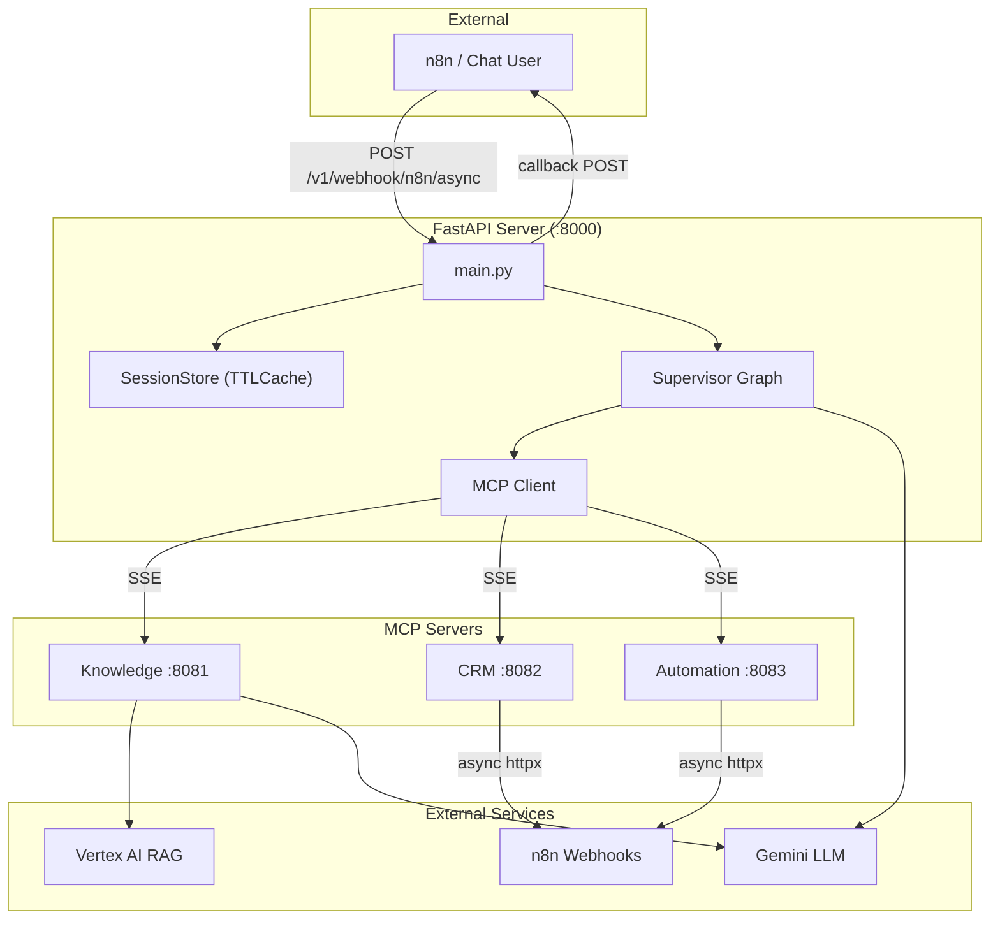
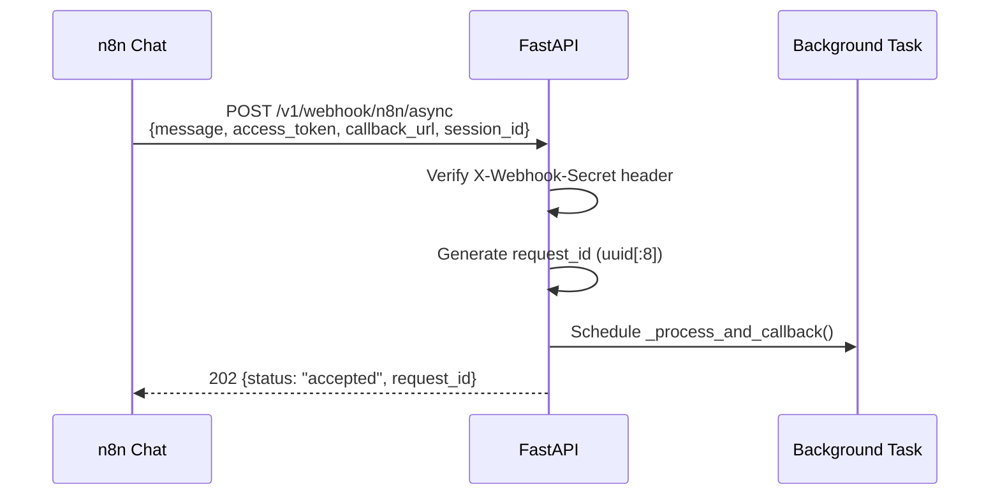
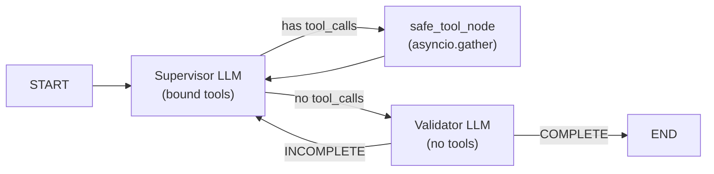

# Enterprise AI Orchestration — System Documentation

## Overview

Python-based backend connecting a conversational AI to CRM task data and internal knowledge bases. Users interact via n8n chat triggers — queries are processed through a multi-agent supervisor loop, and results are delivered back via webhook callbacks.

## Architecture



---

## Full Request Pipeline (Step by Step)

This is the complete lifecycle of a user query, from n8n to final callback.

### Phase 1: Request Intake



**Files:** `main.py` → `n8n_webhook_async()` → `_process_and_callback()`

### Phase 2: Session Memory Load

```
_process_and_callback()
  → _run_ai_query(graph, query, access_token, request_id, session_id)
    → session_store.load_history(session_id)
      → Returns List[HumanMessage, AIMessage, SystemMessage] from previous turns
    → Build initial_state with messages + access_token + request_id
    → graph.ainvoke(initial_state)
```

**Files:** `main.py` → `app/session_store.py` (TTLCache, 5min TTL, max 10 turns)

### Phase 3: Supervisor Graph Execution



**Max 6 iterations.** Each iteration:

1. **Supervisor** receives full message history + system prompt with `access_token`
2. Supervisor decides which tools to call (can request multiple in one turn)
3. **safe_tool_node** executes ALL requested tools **in parallel** via `asyncio.gather`
4. Each tool runs in its own try/except — if one fails, others still return data
5. Results (raw JSON) are added as `ToolMessage` objects to state
6. Supervisor sees results → either calls more tools or generates final answer
7. **Validator** checks completeness → COMPLETE or INCOMPLETE with reason
8. If INCOMPLETE → loop back to supervisor with a nudge message

**Files:** `app/graphs/supervisor.py` (system prompt, safe_tool_node, validator)

### Phase 4: Tool Execution (CRM Example)

```
safe_tool_node receives AIMessage with tool_calls:
  [get_subtasks(T-501), get_comments(T-501), get_approvals(T-501)]

For each tool call (in parallel via asyncio.gather):
  → tool_map["get_subtasks"].ainvoke(args)
    → call_n8n_webhook(url, token, {task_id: "T-501"})
      → httpx POST to n8n webhook with X-Webhook-Secret
        → n8n workflow fetches data from CRM
        → Returns raw JSON response
      → Retry once on timeout/502/503/504
    → Returns JSON string
  → Wrapped in ToolMessage(content=json_str, tool_call_id=call_id)

If tool fails:
  → Returns ToolMessage(content="Error: TimeoutException: ...", tool_call_id=call_id)
  → Supervisor continues with partial data from other tools
```

**Files:** `mcp_server/crm/tools.py` → `mcp_server/shared/webhook_helper.py`

### Phase 5: Final Answer & Callback

```
graph.ainvoke() returns final state
  → Extract answer from last AIMessage
  → Extract iteration count, tools_used, execution_time_ms
  → Save turn to session_store
  → POST callback to n8n with shared httpx client:
    {
      answer: "Task T-501 has 3 subtasks: ...",
      tools_used: ["get_subtasks", "get_approvals", "get_comments"],
      status: "completed",
      execution_time_ms: 3450,
      iterations: 2,
      tools_called_count: 3
    }
  → n8n displays answer in chat
```

**Files:** `main.py` → `_run_ai_query()` → `_process_and_callback()`

---

## Request Decomposition

The supervisor LLM decomposes complex queries into parallel tool calls:

| Request Type | Tools Called |
|:-------------|:------------|
| Simple | 1 tool (e.g. `get_task_comments`) |
| Status/progress | `get_subtasks` + `get_checklists` |
| Blocked/ready | `get_subtasks` + `get_approvals` + `get_checklists` |
| Full summary | All 5 CRM tools in parallel |
| Cross-task | Same tool × N task IDs in parallel |

---

## Project Structure

```
AI_Orchestration/
├── main.py                          # FastAPI v4.0.0, all endpoints, background processing
├── app/
│   ├── config.py                    # Pydantic settings, Vertex AI init
│   ├── utils.py                     # get_gemini_llm() via ChatGoogleGenerativeAI
│   ├── security.py                  # Auth, permissions, input sanitization, rate limiter
│   ├── session_store.py             # TTL-based conversation memory (cachetools)
│   ├── mcp_client.py                # Multi-server MCP client + tool routing
│   └── graphs/
│       ├── state.py                 # AgentState (messages, access_token, request_id, ...)
│       └── supervisor.py            # Supervisor → safe_tool_node → Validator loop
├── mcp_server/
│   ├── shared/
│   │   ├── llm_helper.py            # Shared Gemini for knowledge tools
│   │   └── webhook_helper.py        # Async httpx + retry (global connection pool)
│   ├── knowledge/
│   │   ├── server.py                # FastMCP :8081
│   │   └── tools.py                 # rag_search (Vertex AI RAG)
│   ├── crm/
│   │   ├── server.py                # FastMCP :8082
│   │   └── tools.py                 # 5 raw JSON tools + decomposition guide
│   ├── automation/
│   │   ├── server.py                # FastMCP :8083
│   │   └── tools.py                 # create_task, send_notification
│   └── start_all.py                 # Launch all 3 MCP servers
└── tests/
    ├── test_crm_e2e.py              # Full pipeline E2E test
    └── test_session_memory.py       # 7 session tests
```

## MCP Tool Inventory

### CRM Server (:8082) — All return raw JSON

| Tool | Args |
|:-----|:-----|
| `get_task_comments` | `access_token`, `task_id` |
| `get_checklists` | `access_token`, `task_id` |
| `get_subtasks` | `access_token`, `task_id` |
| `get_approvals` | `access_token`, `task_id` |
| `get_time_tracking` | `access_token`, `task_id` |

### Automation Server (:8083)

| Tool | Args |
|:-----|:-----|
| `create_task` | `access_token`, `title`, `description` |
| `send_notification` | `access_token`, `recipient`, `message`, `channel` |

### Knowledge Server (:8081)

| Tool | Args |
|:-----|:-----|
| `rag_search` | `query` |

## Error Handling

| Layer | Strategy |
|:------|:---------|
| **Webhook calls** | 1 retry on timeout/connection/502-504, 0.5s delay |
| **Tool execution** | `safe_tool_node`: per-tool try/except, partial data on failure |
| **Supervisor loop** | Max 6 iterations, duplicate validation detection |
| **Callback** | Error payload sent if processing fails |
| **Rate limiting** | 60 req/user/min (API), 3 req/sec (LLM) |

## Session Memory

| Parameter | Value |
|:----------|:------|
| TTL | 300s (5 min) |
| Max sessions | 200 |
| Max turns | 10 |
| Human cap | 500 chars |
| AI cap | 1000 chars |

## API Endpoints

| Method | Endpoint | Auth | Description |
|:-------|:---------|:-----|:------------|
| POST | `/v1/chat` | `X-Auth-Token` | Chat with session memory |
| POST | `/v1/chat/stream` | `X-Auth-Token` | Streaming chat (SSE) |
| POST | `/v1/webhook/n8n` | `X-Webhook-Secret` | Sync webhook |
| POST | `/v1/webhook/n8n/async` | `X-Webhook-Secret` | Async webhook + callback |
| GET | `/health` | — | Deep health check |

## Callback Payload

```json
{
  "answer": "Task T-501 has 3 subtasks...",
  "tools_used": ["get_subtasks", "get_approvals"],
  "status": "completed",
  "execution_time_ms": 3450,
  "iterations": 2,
  "tools_called_count": 3
}
```

## Environment Variables

| Variable | Description |
|:---------|:------------|
| `GOOGLE_APPLICATION_CREDENTIALS` | Path to service-account.json |
| `GOOGLE_PROJECT_ID` | GCP project ID |
| `GEMINI_MODEL` | Model name (default: `gemini-2.5-flash-lite`) |
| `N8N_WEBHOOK_SECRET` | Shared secret for webhook auth |
| `N8N_WEBHOOK_CRM_GET_COMMENTS` | n8n comments webhook |
| `N8N_WEBHOOK_CRM_GET_CHECKLISTS` | n8n checklists webhook |
| `N8N_WEBHOOK_CRM_GET_SUBTASKS` | n8n subtasks webhook |
| `N8N_WEBHOOK_CRM_GET_APPROVALS` | n8n approvals webhook |
| `N8N_WEBHOOK_CRM_GET_TIME` | n8n time tracking webhook |
| `N8N_WEBHOOK_AUTOMATION_CREATE_TASK` | n8n task creation webhook |
| `N8N_WEBHOOK_AUTOMATION_SEND_NOTIFICATION` | n8n notification webhook |

## Changelog

| Version | Changes |
|:--------|:--------|
| 4.0.0 | Removed deals. Raw JSON CRM tools. Supervisor decomposition. safe_tool_node (parallel + error isolation). Execution metrics in callback. Request tracing. Compact prompts. |
| 3.1.0 | Pydantic V2, JSON logging, httpx, webhook retry, session memory |
| 3.0.0 | Session memory, async httpx, ChatGoogleGenerativeAI migration |
