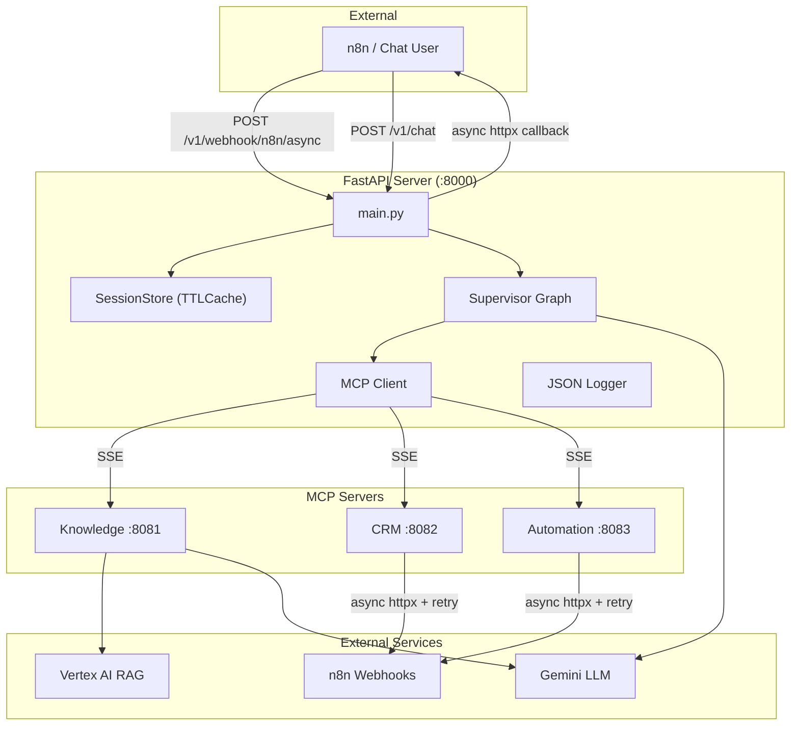
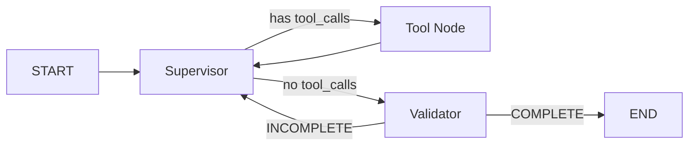
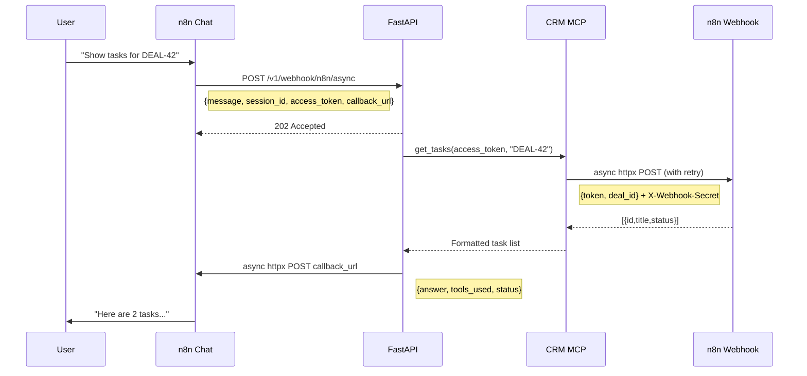

# Enterprise AI Orchestration — System Documentation

## Overview

Enterprise AI Orchestration is a Python-based backend that connects a conversational AI assistant to CRM business data and internal knowledge bases. Users interact via n8n chat triggers — their messages are processed through a multi-agent system that routes queries to specialized MCP (Model Context Protocol) tool servers, and results are delivered back via webhook callbacks.

## Architecture



## Technology Stack

| Technology | Version | Purpose |
|:-----------|:--------|:--------|
| **Python** | 3.12+ | Runtime |
| **FastAPI** | 0.100+ | HTTP server, webhook endpoints |
| **LangGraph** | 0.x | Agent graph framework (supervisor → tools → validator loop) |
| **LangChain** | 0.3+ | LLM abstraction, tool binding |
| **langchain-google-genai** | 4.2+ | `ChatGoogleGenerativeAI` LLM wrapper (replaces deprecated `ChatVertexAI`) |
| **Gemini** | 2.5-flash-lite | Language model |
| **Vertex AI RAG** | SDK | Knowledge base retrieval (RAG corpus) |
| **MCP (FastMCP)** | — | Model Context Protocol server framework |
| **n8n** | — | Workflow automation (CRM webhooks, chat triggers) |
| **httpx** | 0.27+ | Async HTTP client with connection pooling (replaces sync `requests`) |
| **cachetools** | 7.0+ | In-memory TTL cache for session storage |
| **Pydantic** | 2.x | Data validation, settings (`ConfigDict`) |
| **ngrok** | — | Public tunnel for local development |
| **Google Cloud** | — | Service account auth, Vertex AI, GCS |

## Project Structure

```
AI_Orchestration/
├── main.py                          # FastAPI entrypoint, all endpoints, JSON logging
├── start_tunnel.py                  # ngrok/SSH tunnel for exposing to n8n
├── gcs_upload.py                    # Upload docs to GCS for RAG indexing
├── .env                             # Environment variables (secrets, URLs)
├── service-account.json             # Google Cloud service account key
│
├── app/                             # Core application
│   ├── config.py                    # Settings (Pydantic ConfigDict), Vertex AI init
│   ├── utils.py                     # get_gemini_llm() via ChatGoogleGenerativeAI
│   ├── security.py                  # Auth, permissions, input sanitization
│   ├── session_store.py             # TTL-based conversation memory
│   ├── mcp_client.py                # Multi-server MCP client + tool routing
│   └── graphs/
│       ├── state.py                 # AgentState TypedDict
│       └── supervisor.py            # Supervisor → Tools → Validator graph
│
├── mcp_server/                      # MCP tool servers
│   ├── shared/
│   │   ├── llm_helper.py            # Shared Gemini LLM via ChatGoogleGenerativeAI
│   │   └── webhook_helper.py        # Async httpx webhook caller + retry logic
│   │
│   ├── knowledge/
│   │   ├── server.py                # FastMCP :8081
│   │   └── tools.py                 # rag_search (Vertex AI SDK)
│   │
│   ├── crm/
│   │   ├── server.py                # FastMCP :8082
│   │   └── tools.py                 # async get_tasks, get_task_comments, etc.
│   │
│   ├── automation/
│   │   ├── server.py                # FastMCP :8083
│   │   └── tools.py                 # async create_task, send_notification
│   │
│   └── start_all.py                 # Launch all 3 MCP servers + watchdog
│
├── docs/
│   └── system_documentation.md      # This file
│
└── tests/
    ├── test_crm_e2e.py              # Full CRM integration E2E test
    ├── test_session_memory.py        # Session memory + isolation tests (7 tests)
    ├── test_crm_webhooks.py          # CRM webhook unit tests
    ├── test_supervisor.py            # Supervisor graph unit tests
    └── test_workflow.py              # Workflow/pipeline tests
```

## Agent Graph (Supervisor Loop)

The core intelligence runs as a LangGraph state machine:



1. **Supervisor** — `ChatGoogleGenerativeAI` with bound MCP tools. Decides which tool(s) to call.
2. **Tool Node** — Executes the selected MCP tool(s) via the MCP client.
3. **Validator** — Separate LLM (no tools) checks if the gathered data fully answers the question.
4. **Loop Protection** — Max 3 iterations. Duplicate validation reasons break the loop.

## MCP Tool Inventory

### Knowledge Server (:8081)
| Tool | Args | Data Source |
|:-----|:-----|:------------|
| `rag_search` | `query` | Vertex AI RAG corpus (direct SDK) |

### CRM Server (:8082)
All tools are `async` and use the shared `webhook_helper.py` (httpx + retry).

| Tool | Args | n8n Webhook |
|:-----|:-----|:------------|
| `get_tasks` | `access_token`, `deal_id` | `N8N_WEBHOOK_CRM_GET_TASKS` |
| `get_task_comments` | `access_token`, `task_id` | `N8N_WEBHOOK_CRM_GET_COMMENTS` |
| `get_checklists` | `access_token`, `task_id` | `N8N_WEBHOOK_CRM_GET_CHECKLISTS` |
| `get_subtasks` | `access_token`, `task_id` | `N8N_WEBHOOK_CRM_GET_SUBTASKS` |
| `get_approvals` | `access_token`, `task_id` | `N8N_WEBHOOK_CRM_GET_APPROVALS` |
| `get_time_tracking` | `access_token`, `task_id` | `N8N_WEBHOOK_CRM_GET_TIME` |

### Automation Server (:8083)
| Tool | Args | n8n Webhook |
|:-----|:-----|:------------|
| `create_task` | `access_token`, `deal_id`, `title`, `description` | `N8N_WEBHOOK_AUTOMATION_CREATE_TASK` |
| `send_notification` | `access_token`, `recipient`, `message`, `channel` | `N8N_WEBHOOK_AUTOMATION_SEND_NOTIFICATION` |

## Webhook Communication

### Async httpx + Retry Logic

All n8n webhook calls use the shared `webhook_helper.py`:

- **Transport**: `httpx.AsyncClient` with global connection pool (100 max, 20 keepalive)
- **Retry**: 1 automatic retry on timeout, connection error, HTTP 502/503/504
- **Retry delay**: 0.5 seconds between attempts
- **Auth**: `X-Webhook-Secret` header on every request
- **Graceful shutdown**: Connection pool closed via FastAPI lifespan handler

### n8n Integration Flow



### Request Payload

```json
{
  "message": "What are the tasks for deal DEAL-42?",
  "session_id": "chat-abc-123",
  "access_token": "user-crm-token",
  "callback_url": "https://n8n.example.com/webhook/ai-response"
}
```

## Session Memory

Both `/v1/chat` and `/v1/webhook/n8n/async` endpoints support session memory.

| Parameter | Value |
|:----------|:------|
| TTL | 300 seconds (5 minutes) |
| Max concurrent sessions | 200 |
| Max turns per session | 10 |
| Human message cap | 500 chars |
| AI answer cap | 1000 chars |

**Data flow:**
1. Request arrives with `session_id` (or `thread_id` for chat endpoint)
2. `session_store.load_history(session_id)` → returns previous messages
3. History is prepended to the new message in LangGraph state
4. After processing, `session_store.save_turn()` saves the condensed turn
5. After 5 minutes of inactivity, session auto-expires

**Session isolation**: Each session is keyed by `session_id`. Sessions cannot access each other's data.

## Logging

All logs are emitted as structured JSON via a custom `JSONFormatter`:

```json
{"ts": "2026-03-03 14:05:00,123", "level": "INFO", "logger": "main", "msg": "Callback sent: HTTP 200"}
```

Fields: `ts` (timestamp), `level`, `logger` (module name), `msg`, `error` (if exception).

## Security

| Layer | Implementation |
|:------|:---------------|
| **Webhook Auth** | `X-Webhook-Secret` header verified server-side |
| **User Auth** | `X-Auth-Token` header → mock user database (replace with JWT for production) |
| **Input Sanitization** | `SecurityService.sanitize_input()` filters prompt injection patterns |
| **Rate Limiting** | 60 requests/user/minute (API) + 3 req/sec LLM rate limiter |
| **Session Isolation** | Each `session_id` is a separate TTLCache key, no cross-access |

## Environment Variables

| Variable | Required | Description |
|:---------|:---------|:------------|
| `GOOGLE_APPLICATION_CREDENTIALS` | ✅ | Path to service-account.json |
| `GOOGLE_PROJECT_ID` | ✅ | GCP project ID |
| `GOOGLE_LOCATION` | ❌ | Region (default: `europe-west4`) |
| `VERTEX_RAG_CORPUS_ID` | ✅ | Full corpus path for RAG |
| `GEMINI_MODEL` | ❌ | Model name (default: `gemini-2.5-flash-lite`) |
| `N8N_WEBHOOK_SECRET` | ✅ | Shared secret for webhook auth |
| `N8N_WEBHOOK_CRM_GET_TASKS` | ✅ | n8n webhook URL for tasks |
| `N8N_WEBHOOK_CRM_GET_COMMENTS` | ✅ | n8n webhook URL for comments |
| `N8N_WEBHOOK_CRM_GET_CHECKLISTS` | ✅ | n8n webhook URL for checklists |
| `N8N_WEBHOOK_CRM_GET_SUBTASKS` | ✅ | n8n webhook URL for subtasks |
| `N8N_WEBHOOK_CRM_GET_APPROVALS` | ✅ | n8n webhook URL for approvals |
| `N8N_WEBHOOK_CRM_GET_TIME` | ✅ | n8n webhook URL for time tracking |
| `N8N_WEBHOOK_AUTOMATION_CREATE_TASK` | ✅ | n8n webhook URL for task creation |
| `N8N_WEBHOOK_AUTOMATION_SEND_NOTIFICATION` | ✅ | n8n webhook URL for notifications |
| `MCP_KNOWLEDGE_URL` | ❌ | Knowledge SSE URL (default: `:8081/sse`) |
| `MCP_CRM_URL` | ❌ | CRM SSE URL (default: `:8082/sse`) |
| `MCP_AUTOMATION_URL` | ❌ | Automation SSE URL (default: `:8083/sse`) |
| `NGROK_AUTHTOKEN` | ❌ | ngrok auth token for tunneling |

## Running the Project

### 1. Start MCP Servers
```bash
python -m mcp_server.start_all
```
Launches all 3 MCP servers with auto-restart on crash.

### 2. Start FastAPI Server
```bash
python main.py
# or
uvicorn main:api --host 0.0.0.0 --port 8000 --reload
```

### 3. Expose to Internet (for n8n)
```bash
python start_tunnel.py
```

## API Endpoints

| Method | Endpoint | Auth | Description |
|:-------|:---------|:-----|:------------|
| POST | `/v1/chat` | `X-Auth-Token` | Chat with session memory |
| POST | `/v1/chat/stream` | `X-Auth-Token` | Streaming chat (SSE) |
| POST | `/v1/webhook/n8n` | `X-Webhook-Secret` | n8n sync webhook |
| POST | `/v1/webhook/n8n/async` | `X-Webhook-Secret` | n8n async webhook + callback |
| POST | `/v1/action/resume` | `X-Auth-Token` | Human-in-the-loop resume |
| GET | `/v1/mcp/status` | — | MCP server health + tool list |
| GET | `/v1/sessions/status` | — | Active session count |
| GET | `/health` | — | Deep health check (graph + MCP + sessions) |

### Health Check Response

```json
{
  "status": "healthy",
  "model": "gemini-2.5-flash-lite",
  "version": "3.1.0",
  "graph_ready": true,
  "mcp_connected": true,
  "mcp_tools": 9,
  "active_sessions": 2
}
```

Status is `"healthy"` when both graph and MCP are ready, `"degraded"` otherwise.

## Error Handling

All endpoints return standardized error responses:

```json
{
  "error": "Rate limit exceeded",
  "detail": "Please wait before making more requests.",
  "request_id": "a1b2c3d4"
}
```

Model: `ErrorResponse(error, detail, request_id)`.

## Testing

### Test Suite

| File | Tests | What It Covers |
|:-----|:------|:---------------|
| `test_crm_e2e.py` | 1 | Full journey: query → supervisor → CRM tool → n8n → callback |
| `test_session_memory.py` | 7 | Continuity, multi-session isolation, TTL expiry, security |
| `test_crm_webhooks.py` | — | CRM webhook calling logic |
| `test_supervisor.py` | — | Supervisor graph decision routing |
| `test_workflow.py` | — | Pipeline workflow tests |

### Running Tests

```bash
# All core tests (8 tests)
python -m pytest tests/test_crm_e2e.py tests/test_session_memory.py -v

# Full suite
python -m pytest tests/ -v
```

## Changelog

| Version | Changes |
|:--------|:--------|
| 3.1.0 | Pydantic V2 ConfigDict, structured JSON logging, graceful httpx shutdown, health check with MCP probing, webhook retry logic, session memory for `/v1/chat`, ErrorResponse model |
| 3.0.0 | Session memory (TTLCache), shared webhook helper, async httpx, ChatGoogleGenerativeAI migration, comprehensive documentation |
| 2.x | Initial MCP architecture, CRM/Knowledge/Automation servers, supervisor graph |
